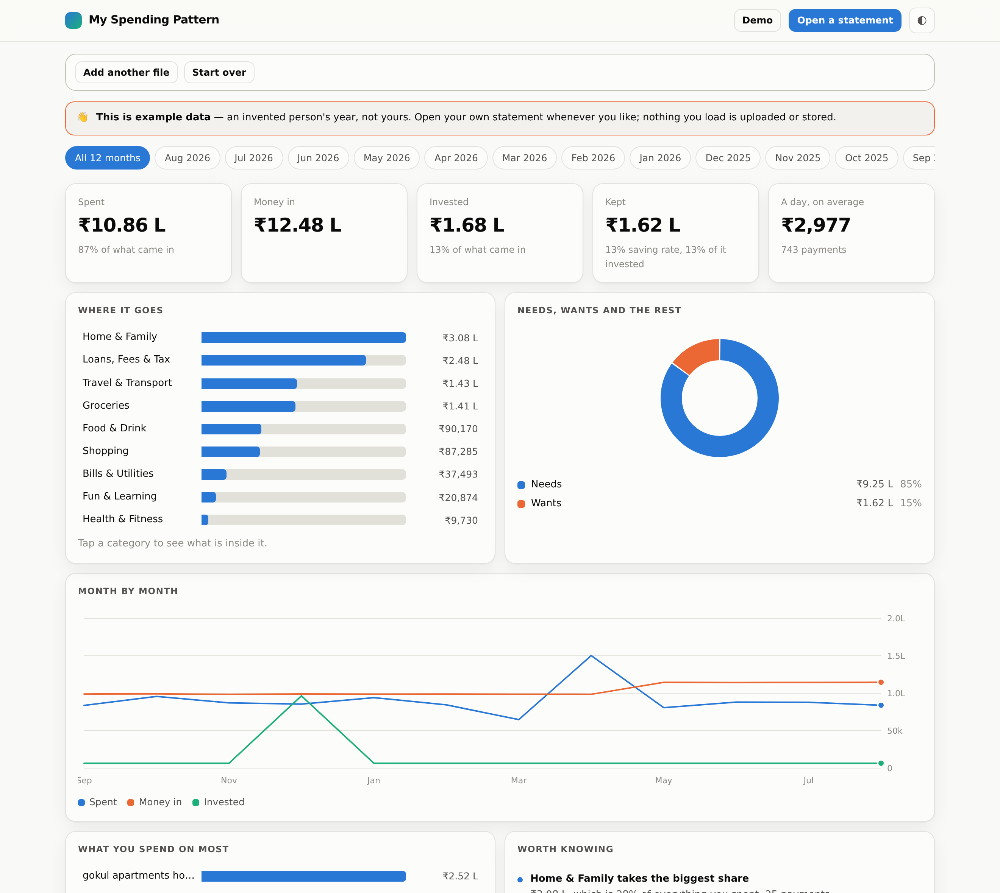
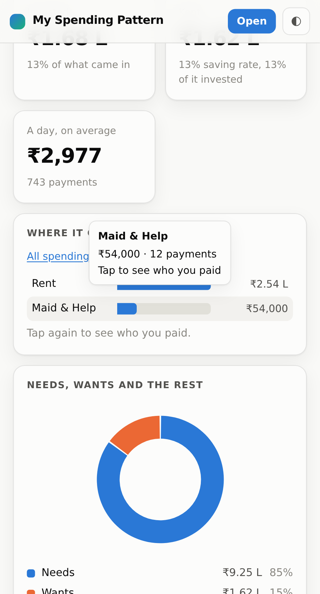

# My Spending Pattern

**A bank statement goes in, an honest picture of a year comes out - entirely
inside your browser. The file is never uploaded, because there is nowhere to
upload it to.**

[**Try it → dsandai.com/spending**](https://dsandai.com/spending) · no signup,
no upload, works offline · [changelog](CHANGELOG.md)



Reads CSV, XLSX, the old binary XLS and PDF - including the
password-protected ones Indian banks actually send - with **no dependencies at
all**. No framework, no build step, no `npm install`. About 6,000 lines of
plain JavaScript that will still run in five years.

---

## Why browser-only, and why that is the whole product

Every other tool in this space asks you to upload a bank statement to a server
you cannot inspect. That is a genuinely large ask, and most people are right to
refuse it.

Here the file is opened with the browser's own `FileReader`, parsed in
JavaScript, categorised by a list of text rules and drawn to the screen. No part
of it is transmitted. **You can verify this yourself in thirty seconds:** open
your browser's developer tools, go to the Network tab, load a statement, and
watch nothing leave. Then switch the network off entirely - after the first
visit it still works, because the service worker has cached the app.

Consequences worth being honest about:

* Nothing is remembered between visits. Close the tab and the analysis is gone.
  That is the trade. A "keep my data" feature would mean storing it either in
  the browser (fine, and planned) or on a server (not fine).
* There is no login, so there is nothing to breach.
* Hosting costs nothing, because it is a static site.

## How this was built

The categorisation started as a TF-IDF classifier trained on several years of my
own labelled transactions - the part of the work that cannot be shortcut, and
the reason the rules know what they know. It worked, and I could not ship it:
the vocabulary of a model trained on my statements *is* my statements, so
publishing the model would publish my merchants. So I read what it had learned
and rebuilt it as rules anyone can read and argue with, in
[`assets/rules.js`](assets/rules.js).

The code was written with Claude as a coding partner, over a series of builds
recorded in [CHANGELOG.md](CHANGELOG.md). What counts as spending, what a
category should be, which cases the tool must refuse to guess at - those
judgements came from my own data and from years of tracking it by hand.

---

## Run it locally

**Double-click `index.html`.** That is the whole thing - it opens in your
browser and works. Press **Show me an example first** and a made-up year appears
immediately.

`Open My Spending Pattern.bat` does the same but serves the folder over http,
which adds two things a page opened from disk cannot have: the offline cache and
"install to home screen". Both need a real server; browsers refuse service
workers on `file://`. You do not need it to use the app.

### One thing to know if you edit the code

The scripts are **plain scripts, not ES modules**, loaded in dependency order
from `index.html` and sharing one global `MSP` object. That is not an
old-fashioned oversight: browsers block ES module imports over `file://`, so
with modules a double-clicked `index.html` renders a page whose every button is
dead, with nothing but a CORS error in a console nobody opens. Being openable
from disk is worth more here than the nicer syntax. If you add a file, add a
`<script>` tag for it in `index.html` and to the `ASSETS` list in `sw.js`.

---

## What it works out

| | |
|---|---|
| **Where the money goes** | Ten headline categories, largest first, with an arrow against last month. Tap one to open its parts, tap again for the payees behind them. Every level adds up to the one above - the tail folds into a visible "everything else" row rather than being dropped, so you can check it by adding it up. |
| **Needs vs wants** | The split people find most uncomfortable and most useful. |
| **Month by month** | Spent, money in and invested, on one scale. |
| **Repeating charges** | The same payee at about the same amount in three or more months - subscriptions you agreed to once and forgot. Shown with the annual cost, which is the number that changes behaviour. |
| **Loan instalments** | Worked out from the statement rather than entered: the same amount leaving on roughly the same day for three months or more. |
| **Worth knowing** | Plain observations ranked by rupees at stake. Arithmetic on your rows, never advice. |



### Three judgements that make the numbers right

Most spending reports get these wrong, and the totals are then meaningless:

1. **Moving money between your own accounts is not spending.** A debit matched
   to an equal credit within a few days is a transfer, not an expense and not
   income. Without this, anyone who shuffles ₹50,000 between two banks each
   month appears to earn and spend ₹6 lakh a year that never existed.
2. **Breaking a deposit is not income.** It is your own savings coming back.
   The same words appear when you open one and when you close it, so the
   direction of the money decides which it was.
3. **Investing is not consumption.** "Kept" is income minus what you spent; an
   SIP is part of what you kept, not a cost. Subtracting it makes the most
   disciplined months look like the worst ones.

There is also a reversal pass: a failed standing instruction and the refund that
undid it are matched on their shared reference number and cancelled, so a failed
payment does not show as an expense *and* a windfall.

---

## Files

```
index.html            the page
sw.js                 offline cache
manifest.webmanifest  makes it installable on a phone
assets/
  rules.js            categories, text cleaning, the rule list
  parse.js            CSV, XLSX, dates, columns, dedup
  xls.js              the old binary .xls, and its encryption
  pdfread.js          PDF text extraction and layout
  crypto.js           MD5, RC4, AES and the key-derivation schemes
  analyse.js          totals, trends, recurring charges, insights
  charts.js           SVG charts, no library
  demo.js             the invented year
  share.js            the canvas cards
  feedback.js         the feedback form
  app.css             one stylesheet
  app.js              the page logic
```

### Supported files

**CSV, XLSX, the old binary XLS, and PDF** - from any bank. All four are read in
the browser with no library:

| Format | How |
|---|---|
| CSV | Hand-written parser: bank CSVs have a preamble above the header and a disclaimer paragraph below the last row, and quoted fields containing newlines. |
| XLSX | A zip of XML, opened with the browser's own `DecompressionStream`. |
| XLS | The old compound-file format ICICI and others still default to. `assets/xls.js` reads the BIFF8 records directly - about 250 lines instead of the megabyte a spreadsheet library costs. |
| PDF | `assets/pdfread.js` inflates the content streams and reads the text-drawing operators, translating glyph codes through the font's ToUnicode table. Columns are found by clustering x-positions across the page, so an empty cell does not shift every later value into the wrong column. |

The header row is found by looking for a date column, so the account details
every bank prints at the top are skipped automatically. Where there is no header
row at all - SBI's current export *draws* its column titles as graphics, so the
word "Description" appears nowhere in the file - the columns are worked out from
the figures instead: one column parses as dates on every row, one is long text
that is neither, and one has a property nothing else has, namely that its
row-to-row difference is explained by another column on that row. That one is
the running balance, and once it is known, direction is arithmetic rather than
guesswork - a figure matching a fall in the balance is money leaving. If both
routes fail, the app shows you the first rows of your own file and asks which
column is which, rather than refusing to open it. Two banks can use the same
words for different things - SBI writes "WDL TFR" on every electronic debit
including a UPI payment to a shop, ICICI only on a real transfer - so wording
that merely names the rail is only trusted when nothing else in the line
identifies a payee. Dates are parsed row by
row, because banks genuinely mix `5/8/2026` and `28-02-2026` inside one export -
and a parser that locks onto the first format silently drops every row in the
other one.

**Both fields that name a payee are read.** An Indian UPI line carries the payee
name truncated to about eight characters, so a supermarket, a municipal
corporation and a DTH provider all arrive as a short string that reads like a
person's name. Beside it sits the handle, which is not truncated and which for a
national merchant spells the brand out. Reading only the first files a canteen
lunch and a utility bill as payments to a person. Both are matched now, and so
is the merchant name a card purchase writes out in full.

**Password-protected files open too.** Indian banks nearly always send locked
statements, so the app asks for the password and decrypts the file in the
browser - PDFs (RC4, AES-128 and AES-256), modern locked `.xlsx` files, and the
old locked `.xls`, whose RC4 CryptoAPI scheme leaves record headers in clear and
enciphers the contents in 1024-byte blocks. An empty password is tried first,
silently, because many statements are only locked against printing. The password
lives in one local variable for the length of one function call: never stored,
never remembered, never sent.

Three cases are refused, each named plainly rather than answered wrongly:

* **PDFs that are pictures.** No fonts, one JPEG per page. Usually not a scanner
  - a password-removal tool that re-rendered every page as an image, which is
  why a 68 KB locked original reads perfectly and the 1 MB "unlocked" copy made
  from it has nothing in it at all. Give it the locked file and let the page ask
  for the password.
* **PDFs whose fonts carry no character map**, where glyphs cannot be turned
  back into letters. The app says so and points at the bank's Excel export.
* **Photographs.** A phone's file picker offers the camera, and photographing a
  statement is a reasonable thing to expect to work. It cannot: a photo is
  pixels, and reading it needs OCR, which guesses. A guessed digit in an amount
  is a wrong total that looks completely normal, and everything else in this
  tool exists to avoid exactly that.

### The name in the header is used

The block of text above the table is not skipped as page furniture. The account
holder's name is read out of it, and a NEFT or IMPS carrying that name is
understood as money moving between your own accounts rather than a payment to
somebody. Those are the largest rows in a statement, so getting them wrong
distorts every total on the page - one test account showed lakhs "spent" against
four actual purchases. Nothing is hardcoded and nothing is kept: the name comes
out of the file you just opened and goes when the tab closes.

The honest limit: a transfer to a different person who shares your surname reads
as your own, and a loan repayment carrying only your name reads as a transfer
rather than an instalment. Both are fixed by adding one rule for that payee near
the top of the list in `assets/rules.js`, where the rules are ordered and the
first match wins.

### Adding a second file

A second statement is **merged** with the first, and rows the two share are
dropped - which is what you want for two banks, or for last month's export and
this month's. Loading the same file twice therefore changes nothing. For a clean
slate, **Start over** sits next to *Add another file*, and clicking the title
top-left does the same.

### Adding a merchant

Open `assets/rules.js`. Add an alias if the name is written several ways, then a
rule:

```js
[/\bbigbasket\b|bbdaily/gi, "BIGBASKET"],          // in ALIASES
R(String.raw`bigbasket|supermarket`, "Groceries"),  // in RULES
```

Rules are ordered and the first match wins, so a specific rule goes above a
general one. `swiggy instamart` must be tested before `swiggy`, or groceries
become food.

---

## What it is not

It does not connect to your bank, it does not give advice, and it does not
predict anything. It reads the file you give it and tells you what is in it.

Categorisation is rules, not a model - every decision it makes can be read in
`rules.js` and argued with. Anything it cannot name is counted under
Miscellaneous and the count is shown, so you always know how much of the picture
is guesswork.

Three things keep that number small without inventing anything:

1. **Trade words, not brands.** Most Indian payees are not chains. No list will
   ever contain the caterer two streets away or a neighbourhood dairy - but a
   caterer sells food whoever owns it, so the rules read the trade word.
2. **The remark field.** A UPI line carries a short purpose the payer typed -
   *Cold drink*, *Haircut*, *Xerox*, *Momo*. It is the only label a bank
   statement ever contains and it was being thrown away.
3. **The file teaches itself.** A payments app writes "Paid to SUNRISE
   CATERERS"; the bank's own line for the same shop is truncated to "SUNRISE".
   Where a payee is recognised under one spelling, its unnamed rows inherit the
   category - but only where two spellings agree, and never over a rule that did
   fire.

Anything still unmatched that was paid to what reads as a person is filed under
**People** rather than Miscellaneous. Knowing that a sixth of the year went to
individuals is a real answer; "uncategorised" is not.

The chart draws **ten headline categories**, not the thirty the rules aim at -
thirty slices is a colour swatch, not a chart. The detail stays on every row, so
tapping a slice still lists the individual payments.

## Sharing a card

Every chart can be redrawn as a phone-sized image - story (9:16) or post (4:5),
dark or light - and saved straight to the camera roll. They are drawn from
scratch on a canvas rather than screenshotted, so the type is large enough to
read while scrolling.

**Amounts can be turned off.** Posting your finances publicly is a different act
from looking at them, so with the switch off the cards show percentages and
rankings only and no rupee figure is drawn anywhere.

## Feedback

The form at the bottom sends only what is typed into its three boxes - never a
transaction, a total, or anything derived from a statement. By default it opens
the visitor's own mail app, so a static site does not quietly acquire a backend
and the sender can see exactly what is going.

---

## Licence, and a request

MIT - see [LICENSE](LICENSE). Use it, fork it, build on it, ship it
commercially. The one condition is the one MIT states: keep the copyright
notice, so the work stays attributed.

**The canonical source is
[github.com/HeyPartha](https://github.com/HeyPartha)** - please pull from here
rather than from a copy, so you get the fixes.

And a request that is not a condition: **if you use this, or build something on
it, I would genuinely like to know.** Open an issue or say hello. It costs you
nothing, and knowing where a thing ended up is most of the reward for putting it
out in the open.

## Changing things

* [CHANGELOG.md](CHANGELOG.md) - every build, and why each change was made.
* **Categories and merchants** live in `assets/rules.js`. The rules are an
  ordered list and the first match wins, so a rule added higher up beats one
  below it. Wording shown on screen is in `index.html` and `assets/app.js`.
* **Hosting it yourself** needs no build step - copy the files to any web
  server and open `index.html`. `.htaccess` carries the HTTPS redirect, the
  MIME types and the security headers, including the Content-Security-Policy
  that stops the page contacting anything. Keep it if your host runs Apache.
* **The one step that catches everyone out:** after changing any file, bump
  `CACHE` in `sw.js` and the build stamp in `index.html`. The service worker
  serves from its cache first, so without a new cache name a returning visitor
  keeps running the old build.
